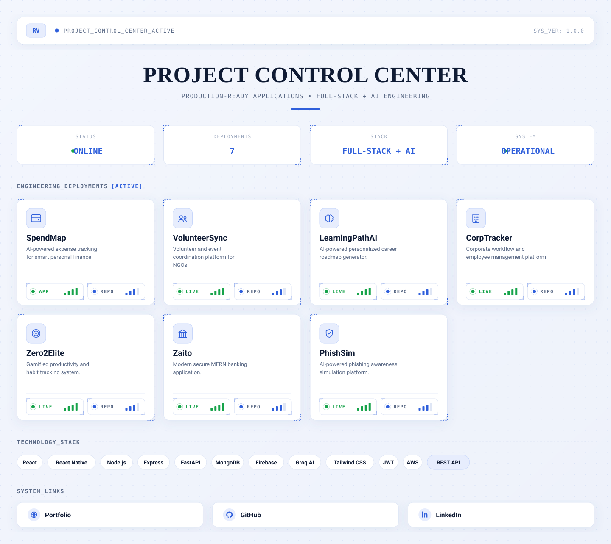

<picture>
  <source media="(prefers-color-scheme: dark)" srcset="assets/dashboard-dark.svg">
  <source media="(prefers-color-scheme: light)" srcset="assets/dashboard-light.svg">
  
</picture>

<a href="https://ragavan-dev.vercel.app">Portfolio</a> ·
<a href="https://github.com/ragavan28v">GitHub</a> ·
<a href="https://www.linkedin.com/in/YOUR-LINKEDIN-HANDLE">LinkedIn</a>

 

<!--
  NOTE: the LIVE / APK / REPO elements inside each project card in the graphic
  above are rendered as status-panel readouts (LED + signal-bar indicators),
  not buttons — this keeps the dashboard from visually implying it's
  clickable, since an <a> baked into an SVG loaded through /<picture>
  never becomes interactive on GitHub, no matter what viewer you're using.
  The table below re-creates every one of those links as real, working buttons.
-->

### 🚀 Projects

<table>
<tr>
<td width="50%" valign="top">

**SpendMap**
AI-powered expense tracking for smart personal finance.

</td>
<td width="50%" valign="top">

**VolunteerSync**
Volunteer and event coordination platform for NGOs.

</td>
</tr>
<tr>
<td width="50%" valign="top">

**LearningPathAI**
AI-powered personalized career roadmap generator.

</td>
<td width="50%" valign="top">

**CorpTracker**
Corporate workflow and employee management platform.

</td>
</tr>
<tr>
<td width="50%" valign="top">

**Zero2Elite**
Gamified productivity and habit tracking system.

</td>
<td width="50%" valign="top">

**Zaito**
Modern secure MERN banking application.

</td>
</tr>
<tr>
<td width="50%" valign="top">

**PhishSim**
AI-powered phishing awareness simulation platform.

</td>
<td width="50%" valign="top">

</td>
</tr>
</table>

